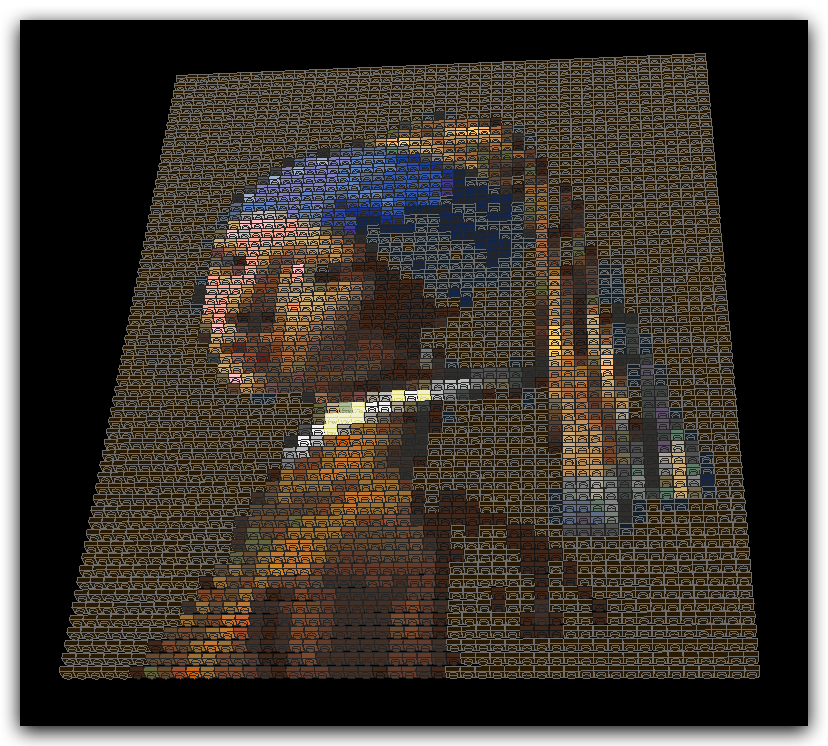
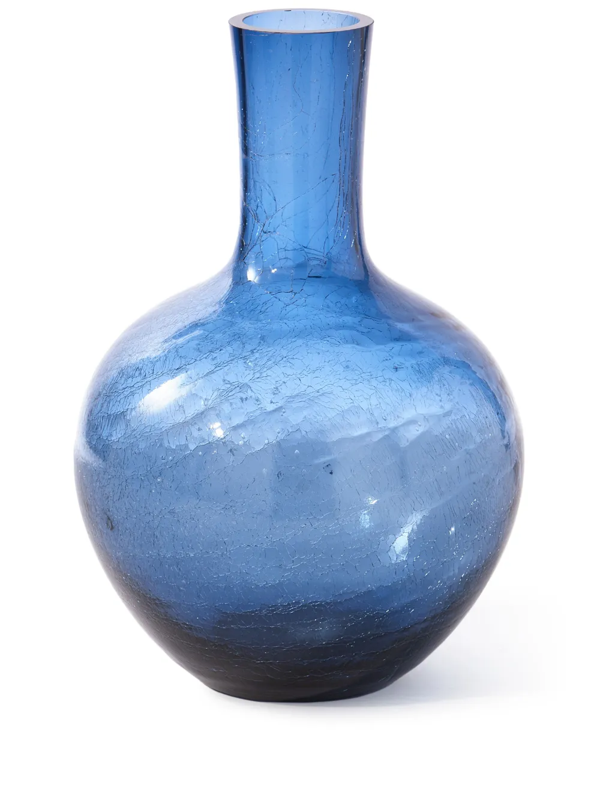

# LDBuilder AI

An AI skill to build virtual LDraw/LEGO models

## Overview
> [!WARNING]
**WIP**: the skill is not ready yet, and the current source code doesn't fully work, but **models can be generated** using a **bundle zip file** on this repository.

The main goal for this project is: making an **agentic LLM** build **virtual LDraw/LEGO models**.

According to their own **definition**, [LDraw](https://www.ldraw.org/) is:

*"..a completely unofficial, community run free CAD system which represents official parts produced by the LEGO company."*

Part of this system is the[ LDraw language](https://www.ldraw.org/article/218.html), an **extremely simple programming language** for **building virtual models**, mostly LEGOs.

This makes possible for an **agentic LLM** to **generate LDraw source code**, that's **equivalent** to **generating a virtual model**.

See the **Results** section below for samples of generated virtual models.

## Quick Start

> [!WARNING]
> Not *every attempt* at generating a new model will be successful!

Generating models via an **agentic LLM** involves just a few easy steps, detailed below.

### Preliminars

The following are **required** downloads:
- The **instructions, information and tools** [zip bundle](https://raw.githubusercontent.com/anteloc/ldbuilder-ai/master/results/bundles/2026-01-22/build-instructions-01.zip)
- The [Official LDraw zipped parts library](https://library.ldraw.org/library/updates/complete.zip)
- [LDView](https://github.com/tcobbs/ldview/releases), an LDraw **models viewer**

Extract the parts library zip file and then [configure LDView](https://trevorsandy.github.io/lpub3d/assets/docs/ldview/Help.html#LDrawLibrary) to use it.

These other downloads are **optional**:
- [Official LDraw models](https://library.ldraw.org/omr) for experimenting
- Models editors:
	- [Stud.io](https://www.bricklink.com/v3/studio/download.page)
	- [LeoCAD](https://www.leocad.org/index.html)
	- [Blender](https://www.blender.org/) + [ldr_tools_blender addon](https://github.com/ScanMountGoat/ldr_tools_blender)

As with LDView, these tools may also require configuration for using the parts library.

### Model Generation

To **start generating** models:
- Log in to the chat website (e.g. https://claude.ai/ or https://chatgpt.com/) 
- Add the following to the initial chat message:
	- The [zip bundle](https://raw.githubusercontent.com/anteloc/ldbuilder-ai/master/results/bundles/2026-01-22/build-instructions-01.zip) you downloaded before
	- The prompt message: 
		- ***"Follow the instructions.md in the attached bundle. Build me a ______"***
- Send the message

Create **more models** on the same conversation by entering more prompts like e.g.:
- ***Build me a car***
- ***Build me a house***
- ***Generate a wizard***
- ...

Then, the agentic LLM will **start the building process** and provide an **LDraw .mpd file** for download when finished.

To **inspect the resulting mode**l, download the `.mpd` file and open it on [LDView](https://tcobbs.github.io/ldview/).

That's it!

## How It Works

**TODO**
- [ ] The LDraw language
- [ ] Parsing the language
- [ ] Adjusting the geometry for the LLM
- [ ] BOMs
- [ ] Models library creation
- [ ] The validation-feedback process loop
- [ ] Pending - RAG
- [ ] Pending - Fine tuning

## Results

> [!TIP]
> Browse these generated models and more on a **3D or VR environment** at:
> 
> [https://anteloc.github.io/ldbuilder-ai-viewer.html](https://anteloc.github.io/ldbuilder-ai-viewer.html)
> 
> **NOTE:** **VR mode** requires a **WebXR-compatible** headset like e.g. *Meta Quest*

 The following models have been generated using **Claude.ai** (Opus 4.5, Opus 4.6 and Sonnet 4.6).

It was a simple process:
- I gave it a **simple prompt**, few constraints, so it would be creative
- Then, it would start the **creation process**, by **generating LDraw source code**
- At the end of the process, I would download the **generated sources (.mpd file)**
- After that, **I would open them in LDView** for inspecting the generated model

The resulting models are **actual editable CAD models**, not only meshes.
This is a model I opened in **Blender**:

[Model A + B: 01-opus-4.5/009-speed_falcon_hybrid.mpd](https://raw.githubusercontent.com/anteloc/ldbuilder-ai/master/results/models/01-opus-4.5/009-speed_falcon_hybrid.mpd)

|                                                                                                                      |                                                                                                                                |
| :------------------------------------------------------------------------------------------------------------------: | ------------------------------------------------------------------------------------------------------------------------------ |
|  |  |

### **Prompt:** _Create a car, you decide about its features_

It has quite some defects, but symmetry is pretty good.

| [01-opus-4.5/001-generated_sports_car.mpd](https://raw.githubusercontent.com/anteloc/ldbuilder-ai/master/results/models/01-opus-4.5/001-generated_sports_car.mpd) |
|:--:|
|  |

### **Prompt:** _now, create a paladin_

It took care itself of dressing the minifig accordingly.

| [01-opus-4.5/002-generated_paladin.mpd](https://raw.githubusercontent.com/anteloc/ldbuilder-ai/master/results/models/01-opus-4.5/002-generated_paladin.mpd) |
|:--:|
|  |

### **Prompt:** _now, another paladin, but this time, a dragonslayer_

Even with only one hint, *"dragonslayer"*, it took care of even choosing a proper shield.

| [01-opus-4.5/003-generated_dragonslayer.mpd](https://raw.githubusercontent.com/anteloc/ldbuilder-ai/master/results/models/01-opus-4.5/003-generated_dragonslayer.mpd) |
|:--:|
|  |

### **Prompt:** _now, a skyscraper, in silver and red, with big windows_

This rendered image is missing several details:

| [01-opus-4.5/004-generated_skyscraper.mpd](https://raw.githubusercontent.com/anteloc/ldbuilder-ai/master/results/models/01-opus-4.5/004-generated_skyscraper.mpd) |
|:--:|
|  |

A better screenshot, from LDView, proof that the requested features are present:

### **Prompt:** _build the Millenium Falcon_

The result is only slightly similar to the original one, with a similar outline.

| [01-opus-4.5/005-generated_millennium_falcon.mpd](https://raw.githubusercontent.com/anteloc/ldbuilder-ai/master/results/models/01-opus-4.5/005-generated_millennium_falcon.mpd) |
|:--:|
|  |

### **Prompt:** _create a squad of 4 firemen_

Two things I've noticed: 
- First, it can count ;-)
- Second, all of the minifigs correctly hold the tools in their right hands.

| [01-opus-4.5/006-generated_fireman_squad.mpd](https://raw.githubusercontent.com/anteloc/ldbuilder-ai/master/results/models/01-opus-4.5/006-generated_fireman_squad.mpd) |
|:--:|
|  |

### **Prompt:** _now, a pilot sitting in a F1 car_

It often happens that it gets rotations wrong, like in this case, with the pilot facing rear instead of front.

| [01-opus-4.5/007-generated_f1_car_with_pilot.mpd](https://raw.githubusercontent.com/anteloc/ldbuilder-ai/master/results/models/01-opus-4.5/007-generated_f1_car_with_pilot.mpd) |
| :-----------------------------------------------------------------------------------------------------------------------------------------------------------------------------: |
|  |

### **Prompt:** _attached you will find a model for the Millenium Falcon.Modify it in order to create a new spaceship_

I gave it this as a baseline to start working.

|                                                                                                       [01-opus-4.5/008-10179_Ultimate_Collectors_Millennium_Falcon.lxf.mpd](https://raw.githubusercontent.com/anteloc/ldbuilder-ai/master/results/models/01-opus-4.5/008-10179_Ultimate_Collectors_Millennium_Falcon.lxf.mpd)                                                                                                       |
| :---------------------------------------------------------------------------------------------------------------------------------------------------------------------------------------------------------------------------------------------------------------------------------------------------------------------------------------------------------------------------------------------------------------------------------: |
|  |

The model being too big, instead of changing its shape, it decided to make it red, and gave it the name *"The Crimson Interceptor"*.

| [01-opus-4.5/008-crimson_interceptor.mpd](https://raw.githubusercontent.com/anteloc/ldbuilder-ai/master/results/models/01-opus-4.5/008-crimson_interceptor.mpd) |
|:--:|
|  |

### **Prompt:** _create a hybrid of these two attached models_

Here I tried something different: gave it two models, and asked it to "merge" them.

The end result it's like it copied the engines and rear wings from A and pasted them onto B.

|     [Model A: 01-opus-4.5/009-4882_Speed_Wings-Model_A.lxf.mpd](https://raw.githubusercontent.com/anteloc/ldbuilder-ai/master/results/models/01-opus-4.5/009-4882_Speed_Wings-Model_A.lxf.mpd)     |
| :------------------------------------------------------------------------------------------------------------------------------------------------------------------------------------------------: |
|  |

|     [Model B: 01-opus-4.5/009-4882_Speed_Wings-Model_B.lxf.mpd](https://raw.githubusercontent.com/anteloc/ldbuilder-ai/master/results/models/01-opus-4.5/009-4882_Speed_Wings-Model_B.lxf.mpd)     |
| :------------------------------------------------------------------------------------------------------------------------------------------------------------------------------------------------: |
|  |

|                                                                     [Model A + B: 01-opus-4.5/009-speed_falcon_hybrid.mpd](https://raw.githubusercontent.com/anteloc/ldbuilder-ai/master/results/models/01-opus-4.5/009-speed_falcon_hybrid.mpd)                                                                     |
| :------------------------------------------------------------------------------------------------------------------------------------------------------------------------------------------------------------------------------------------------------------------------------------------------------------------: |
|  |

### **Prompt:** _from the attached model, create a new one that contains only the plane_

Now, I tested extracting a submodel from a model: get me the plane alone!

| [01-opus-4.5/010-4209_Ffire_Plane.lxf.mpd](https://raw.githubusercontent.com/anteloc/ldbuilder-ai/master/results/models/01-opus-4.5/010-4209_Ffire_Plane.lxf.mpd) |
|:--:|
|  |

It failed the first attempt, and extracted the car and wagon, instead of the plane.

| [01-opus-4.5/010-A-fire_plane_only.mpd](https://raw.githubusercontent.com/anteloc/ldbuilder-ai/master/results/models/01-opus-4.5/010-A-fire_plane_only.mpd) |
|:--:|
|  |

### **Prompt:** _actually, this is not the plane, but the car and its wagon. try again._

Second attempt at extracting the plane, this came out better than before.
The plane is missing several parts, but the ones present seem to be correct.

| [01-opus-4.5/010-B-fire_plane_only.mpd](https://raw.githubusercontent.com/anteloc/ldbuilder-ai/master/results/models/01-opus-4.5/010-B-fire_plane_only.mpd) |
|:--:|
|  |

### **Prompt:** _remove the people from the attached model_

This was an actual surprise, I gave it the following model:

|        [01-opus-4.5/011-2150_Ttrain_Station.ldr](https://raw.githubusercontent.com/anteloc/ldbuilder-ai/master/results/models/01-opus-4.5/011-2150_Ttrain_Station.ldr)         |
| :----------------------------------------------------------------------------------------------------------------------------------------------------------------------------: |
|  |

... and it *"removed"* the people there, but **left most** of their clothes, hair, etc. **intact** (!)

|       [01-opus-4.5/011-train_station_no_people.ldr](https://raw.githubusercontent.com/anteloc/ldbuilder-ai/master/results/models/01-opus-4.5/011-train_station_no_people.ldr)       |
| :---------------------------------------------------------------------------------------------------------------------------------------------------------------------------------: |
|  |

### **Prompt:** _ok, now: add some people to the model, dressed accordingly_

It added several minifigs, in winter garments, but their hats were oddly attached.

| [01-opus-4.5/012-10267-1.mpd](https://raw.githubusercontent.com/anteloc/ldbuilder-ai/master/results/models/01-opus-4.5/012-10267-1.mpd) |
|:--:|
|  |

| [01-opus-4.5/012-generated_10267_with_people.mpd](https://raw.githubusercontent.com/anteloc/ldbuilder-ai/master/results/models/01-opus-4.5/012-generated_10267_with_people.mpd) |
|:--:|
|  |

### **Prompt:** _Create a car, you decide about its features_

Same prompt I used before with Claude Opus 4.5, now with Sonnet 4.6 is way better!

| [02-sonnet-4.6/001-generated_sports_car.mpd](https://raw.githubusercontent.com/anteloc/ldbuilder-ai/master/results/models/02-sonnet-4.6/001-generated_sports_car.mpd) |
|:--:|
|  |

### **Prompt:** _now, a cat_

Just took a ready-made minifig and placed it on a base.

| [02-sonnet-4.6/002-generated_cat.mpd](https://raw.githubusercontent.com/anteloc/ldbuilder-ai/master/results/models/02-sonnet-4.6/002-generated_cat.mpd) |
|:--:|
|  |

### **Prompt:** _now, a plane, a fast one!_

Not a good result, simmetry was clearly wrong.

| [02-sonnet-4.6/003-generated_fighter_jet.mpd](https://raw.githubusercontent.com/anteloc/ldbuilder-ai/master/results/models/02-sonnet-4.6/003-generated_fighter_jet.mpd) |
|:--:|
|  |

### **Prompt:** _it has some structural defects, symmetry errors... fix them._

Besides this prompt, I also attached a screenshot from top perspective for the previous defective model. It analyzed the image, correctly detected several symmetry errors, and partially fixed them.

Before:

| [02-sonnet-4.6/003-generated_fighter_jet.mpd (top)](https://raw.githubusercontent.com/anteloc/ldbuilder-ai/master/results/models/02-sonnet-4.6/003-generated_fighter_jet.mpd) |
| :---------------------------------------------------------------------------------------------------------------------------------------------------------------------------: |
|           |

After:

|             [02-sonnet-4.6/003-generated_fighter_jet_v2.mpd (top)](https://raw.githubusercontent.com/anteloc/ldbuilder-ai/master/results/models/02-sonnet-4.6/003-generated_fighter_jet_v2.mpd)              |
| :----------------------------------------------------------------------------------------------------------------------------------------------------------------------------------------------------: |
|  |

End result (partially fixed):

|                                                                         [02-sonnet-4.6/003-generated_fighter_jet_v2.mpd (isometric)](https://raw.githubusercontent.com/anteloc/ldbuilder-ai/master/results/models/02-sonnet-4.6/003-generated_fighter_jet_v2.mpd)                                                                         |
| :---------------------------------------------------------------------------------------------------------------------------------------------------------------------------------------------------------------------------------------------------------------------------------------------------------------------------------------: |
|  |

### **Prompt:** _now, a skyscraper, 25 floors, in silver and red, with big windows_

This really amazed me, even though the resulting model has structural defects. 

It got it right by creating a small python script that would create all the floors by repeating the same one... 25 times!

| [02-sonnet-4.6/004-generated_25_floors_skyscraper.mpd](https://raw.githubusercontent.com/anteloc/ldbuilder-ai/master/results/models/02-sonnet-4.6/004-generated_25_floors_skyscraper.mpd) |
|:--:|
|  |

### **Prompt:** _build a stadium_

This one took **743 parts (pieces) across 9 sub-models**, according to itself (Sonnet 4.6. )
The supports under the base plate don't make much sense, but for the rest, structurally speaking, it seems pretty good. 

[This is the script](https://raw.githubusercontent.com/anteloc/ldbuilder-ai/master/results/assets/generate_stadium.py) it created and run itself for generating the stadium.

|                                                        [02-sonnet-4.6/005-generated_stadium.mpd](https://raw.githubusercontent.com/anteloc/ldbuilder-ai/master/results/models/02-sonnet-4.6/005-generated_stadium.mpd)                                                         |
| :----------------------------------------------------------------------------------------------------------------------------------------------------------------------------------------------------------------------------------------------------------------------------: |
|  |

### **Prompt:** _build me the attached building_

I gave it this photo from an iconic building, the Bradbury, just to test how accurate it is when copying something real. 

Because of being a famous building, it had extra information, took that into account, and this is the end result:

|                                                                [04-opus-4.6/001-generated_bradbury_building.mpd](https://raw.githubusercontent.com/anteloc/ldbuilder-ai/master/results/models/04-opus-4.6/001-generated_bradbury_building.mpd)                                                                |
| :-----------------------------------------------------------------------------------------------------------------------------------------------------------------------------------------------------------------------------------------------------------------------------------------------------------: |
|  |

### **Prompt:** _now, build me this other attached building_

I gave it a drawing of a regular building, so it wouldn't have any extra information besides what it could infer from the picture.

The floors on the lower levels of the model have four windows per side, instead of the three in the picture.
However, windows in the picture are of different sizes, but in the model they are the same size.

|                                                                      [04-opus-4.6/002-generated_tiered_building.mpd](https://raw.githubusercontent.com/anteloc/ldbuilder-ai/master/results/models/04-opus-4.6/002-generated_tiered_building.mpd)                                                                      |
| :-------------------------------------------------------------------------------------------------------------------------------------------------------------------------------------------------------------------------------------------------------------------------------------------------------------------: |
|  |

### **Prompt:** _now, replicate the attached picture on a mosaic, using blocks_

The picture I gave it was:

The resulting model, oddly, was upside-down:

| [04-opus-4.6/003-generated_mosaic.mpd](https://raw.githubusercontent.com/anteloc/ldbuilder-ai/master/results/models/04-opus-4.6/003-generated_mosaic.mpd) |
|:--:|
|  |

After opening the model in LDView and rotating it, I got this:

### **Prompt:** _attached you will find the image of a transparent vase._

Here I asked for it to **create a python script** that would **generate** the LDraw source code to build the attached image.

**Full prompt** was: 

*now, the following task will be different. attached you will find the image of a transparent vase. I want you to create a big vase, but because I want a huge number of pieces, we will do the following:*

- *instead of directly building the vase, create a python script that generates the required ldraw instructions to create it*
- *instead of using custom pieces, use 1-stud pieces as if they were voxels*

The attached vase image:

It successfully created the requested [python script](https://raw.githubusercontent.com/anteloc/ldbuilder-ai/master/results/assets/generate_vase.py) to **generate the vase**, **5,074 pieces** in size.

| [04-opus-4.6/004-generated_vase.mpd](https://raw.githubusercontent.com/anteloc/ldbuilder-ai/master/results/models/04-opus-4.6/004-generated_vase.mpd) |
|:--:|
|  |

## Acknowledgements

I'd like to thank the following:

- [The LDraw Community](https://www.ldraw.org)
- [LDView](https://tcobbs.github.io/ldview/)'s authors and contributors.
- [LeoCAD](https://github.com/leozide/leocad)'s authors and contributors.

... and thanks to all of the many other LDraw creators!